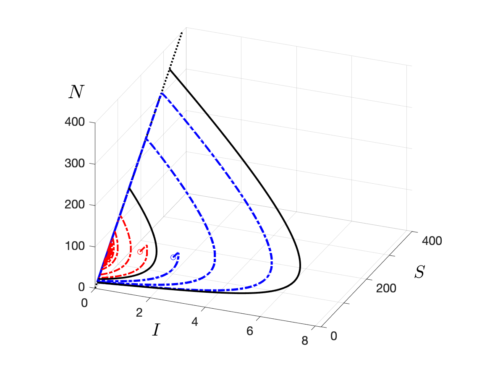
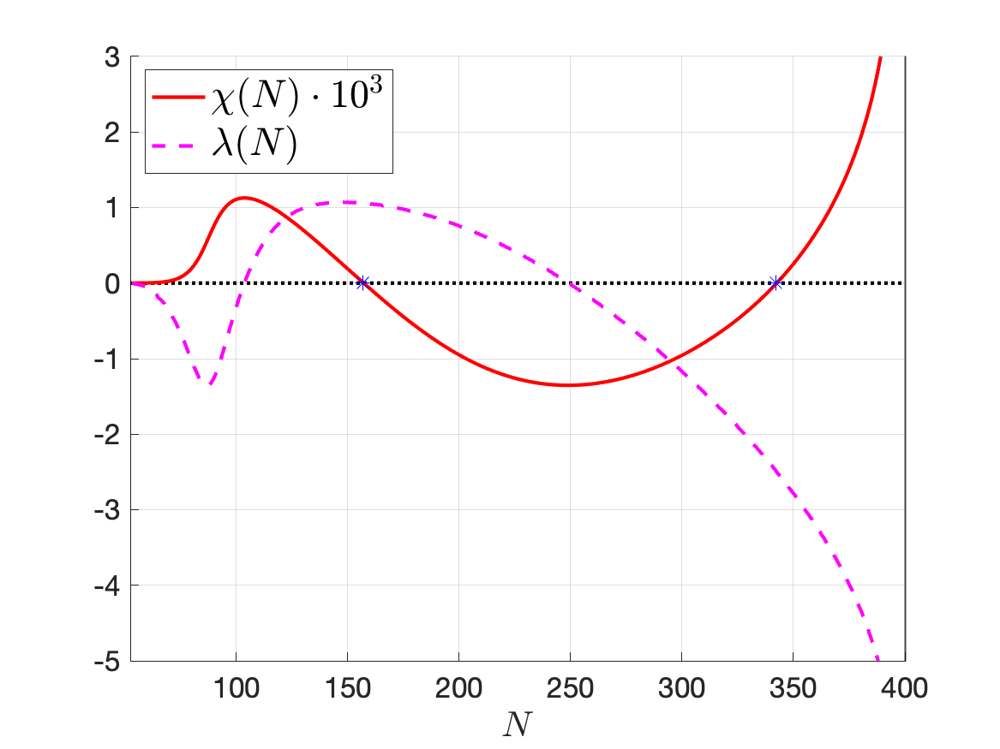
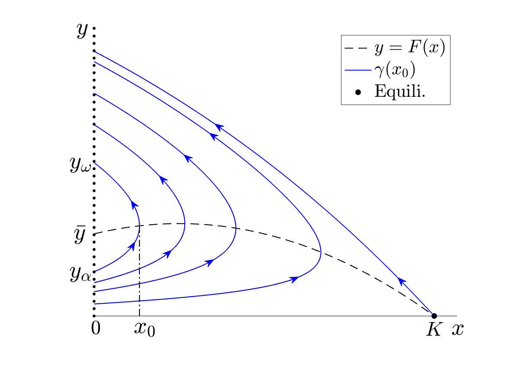
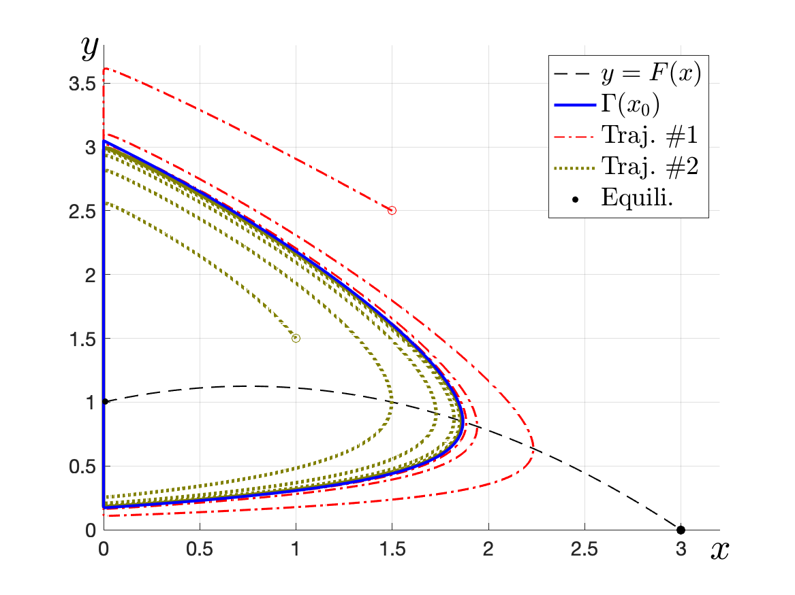
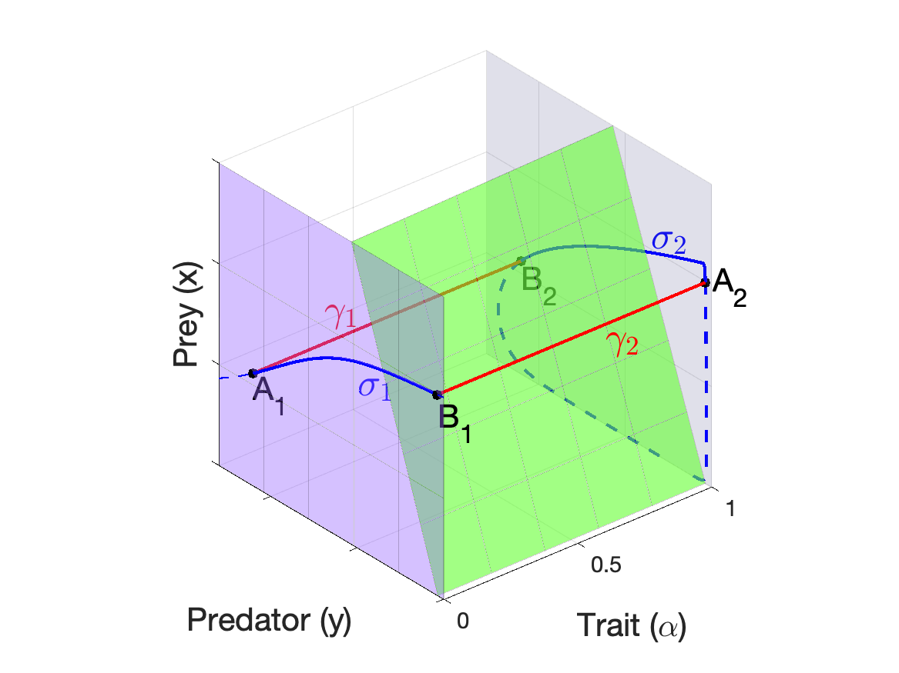
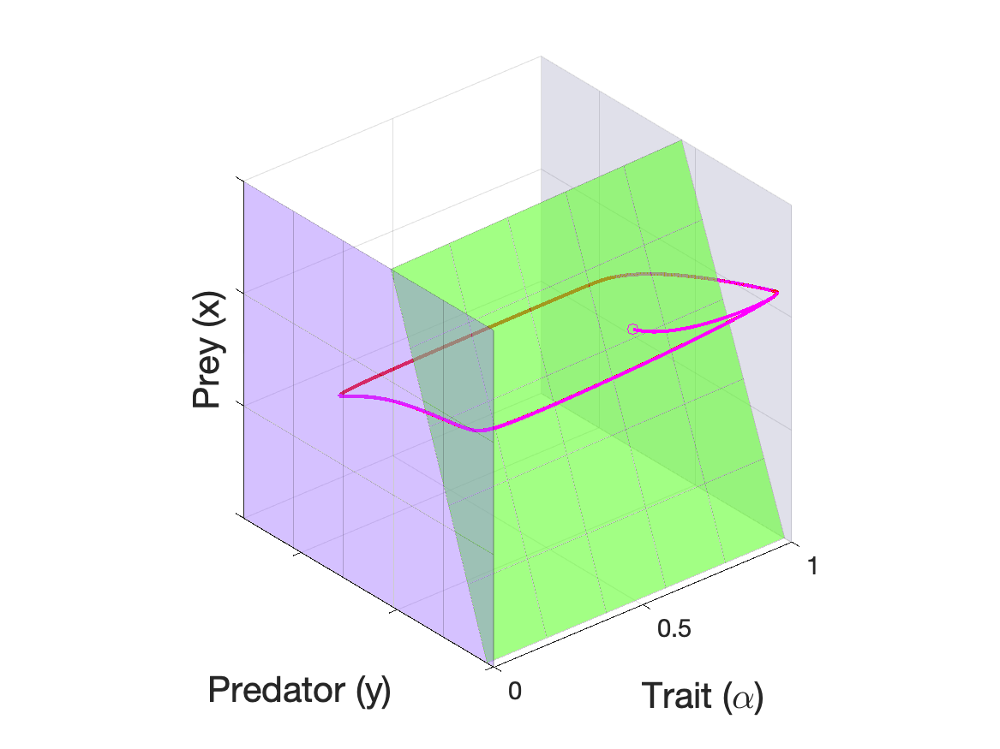

# Graphing Singularly Perturbed Differential Equations

Here is to display source code of graphs in the author's published papers on *Slow-Fast Systems*
(a type of *Singularly Perturbed Differential Equations*)
written in MATLAB scripts.

## [An Epidemic Model](./dcds-b-2020)

**Ting-Hao Hsu** and Gail S. K. Wolkowicz, *A criterion for the existence of relaxation oscillations with applications to predator-prey systems and an epidemic model*, Discrete Contin. Dyn. Syst. Ser. B, 25 (2020), pp.1257-1277.
[[doi:10.3934/dcdsb.2019219](https://www.aimsciences.org/article/doi/10.3934/dcdsb.2019219)]
[[arXiv.1811.08307](https://arxiv.org/abs/1811.08307)]

|  |  |
| -- | -- |

## [Predator-Prey](./siads-2019)

**Ting-Hao Hsu**, *Number and stability of relaxation oscillations for predator-prey systems with small death rates*, SIAM J. Appl. Dyn. Syst., 18 (2019), pp. 33-67.
[[doi:10.1137/18M1166705](https://doi.org/10.1137/18M1166705)]
[[arXiv.1801.02590](https://arxiv.org/abs/1801.02590)]

|  |  |
| -- | -- |

## [Rapid Evolution](./sima-2021)

**Ting-Hao Hsu** and Shigui Ruan, *Relaxation oscillations and the entry-exit function in multi-dimensional slow-fast systems*, SIAM J. Math. Anal., 53 (2021), pp. 3717-3758.
[[doi:10.1137/19M1295507](https://doi.org/10.1137/19M1295507)]
[[arXiv.1910.06318](https://arxiv.org/abs/1910.06318)]

|  |  |
| -- | -- |
