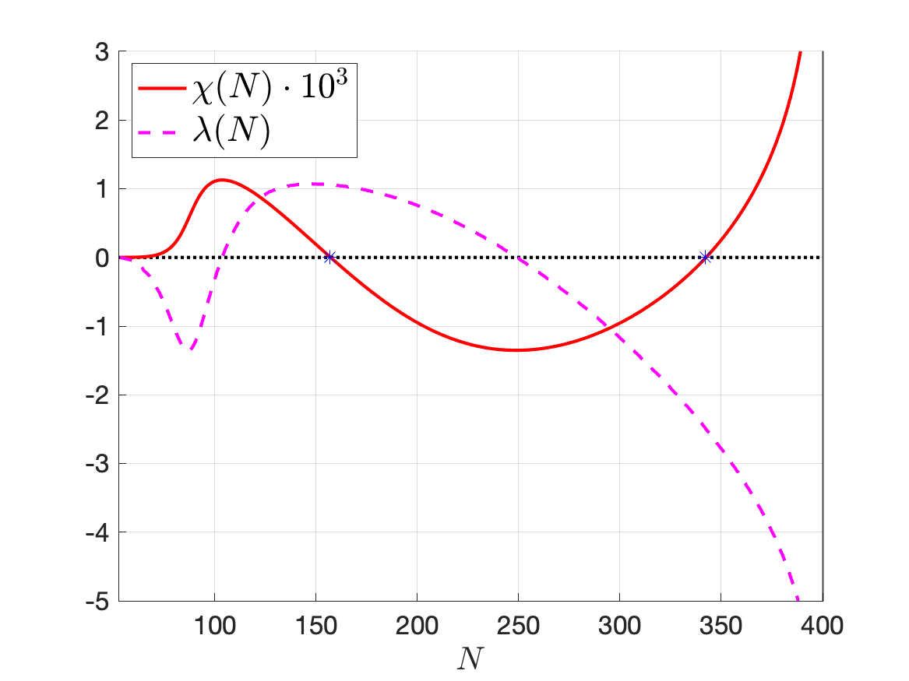
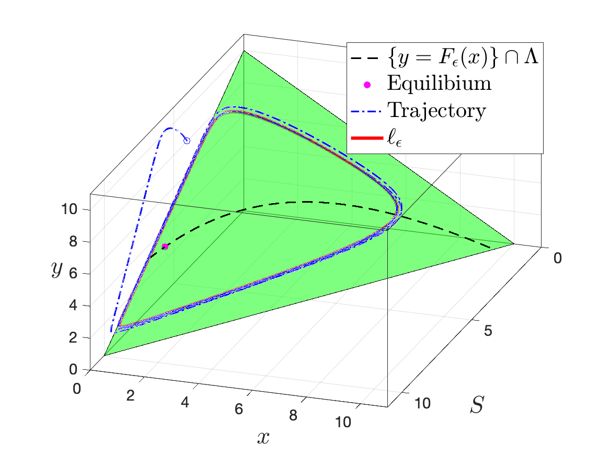
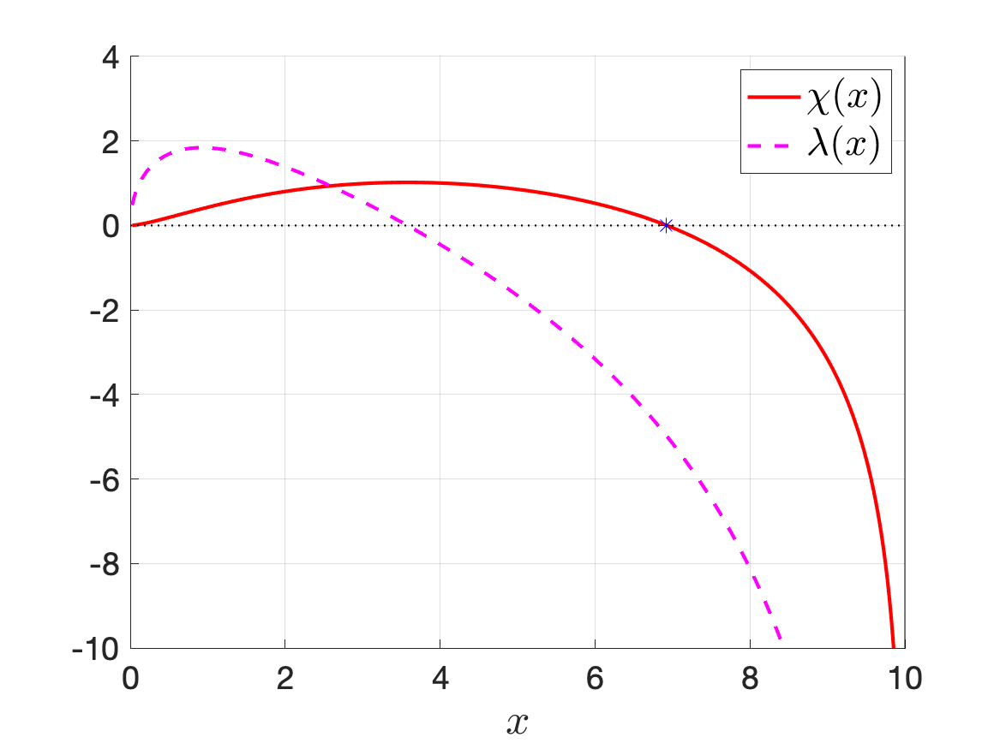

# Epidemic Model1

## Journal Link

**Ting-Hao Hsu** and Gail S. K. Wolkowicz, *A criterion for the existence of relaxation oscillations with applications to predator-prey systems and an epidemic model*, Discrete Contin. Dyn. Syst. Ser. B, 25 (2020), pp.1257-1277.
[[doi:10.3934/dcdsb.2019219](https://www.aimsciences.org/article/doi/10.3934/dcdsb.2019219)]
[[arXiv.1811.08307](https://arxiv.org/abs/1811.08307)]

## Graphing

### Epidemic Model

Run the following MATLAB scripts in the given order.

1. [SIN_gamma.m](epidemic-model/SIN_gamma.m)\

2. [SIN_chi_lambda.m](epidemic-model/SIN_chi_lambda.m)\
\

3. [SIN_epsilon.m](epidemic-model/SIN_epsilon.m)\
\

### Chemostat

- (source code to be added)\
\
\

