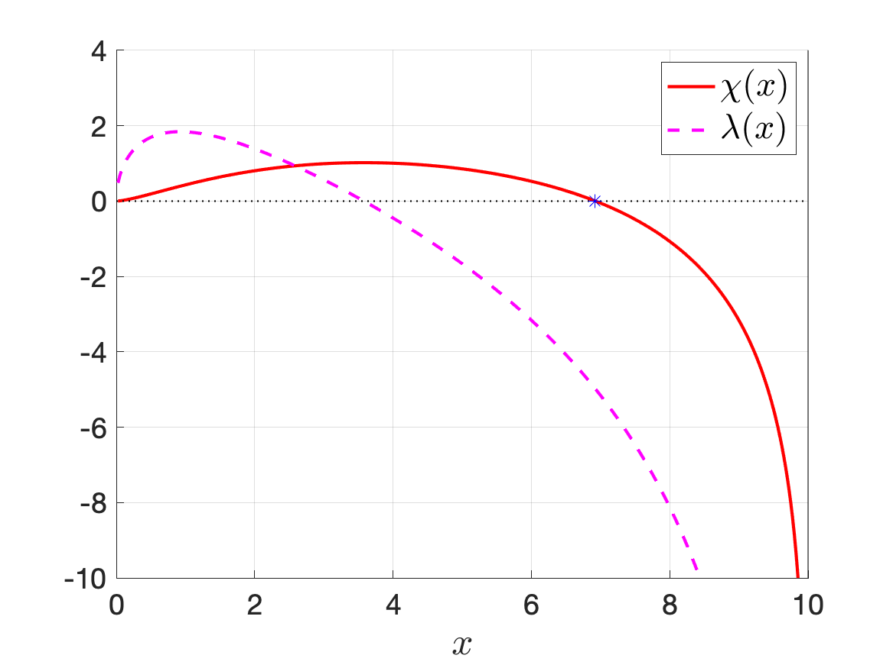
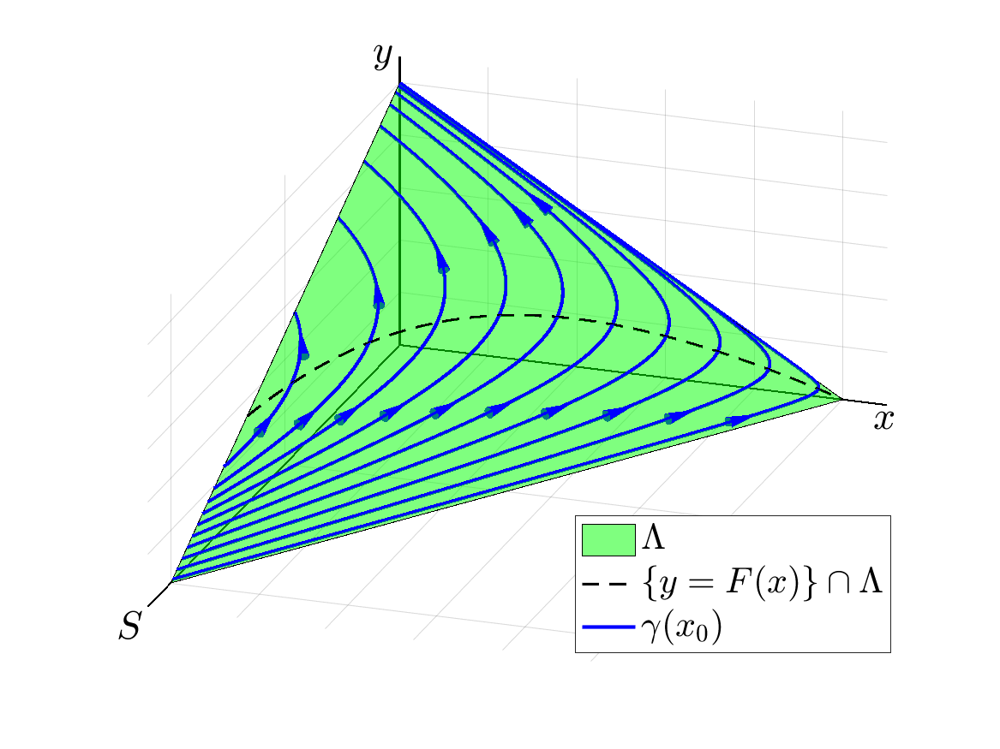
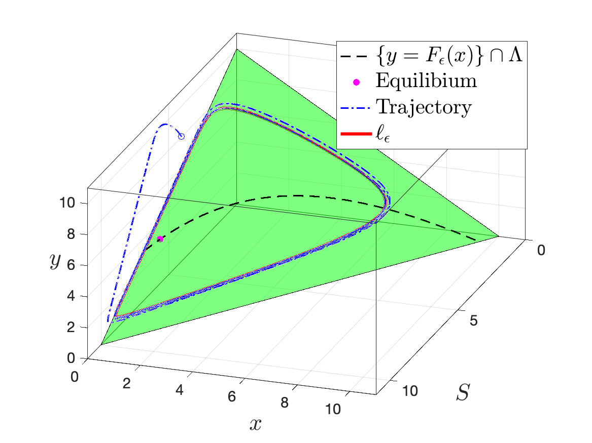

## DCDS-B, 2020

**Ting-Hao Hsu** and Gail S. K. Wolkowicz, *A criterion for the existence of relaxation oscillations with applications to predator-prey systems and an epidemic model*, [Discrete Contin. Dyn. Syst. Ser. B, 25 (2020), pp.1257-1277](https://www.aimsciences.org/article/doi/10.3934/dcdsb.2019219)

[*A Criterion for the Existence of Relaxation Oscillations with Applications to Predator-Prey Systems and an Epidemic Model*](https://www.aimsciences.org/article/doi/10.3934/dcdsb.2019219), Discrete Contin. Dyn. Syst. Ser. B, 25 (2020), pp.1257-1277

Public version: [arXiv.1811.08307](https://arxiv.org/abs/1811.08307)

[check here](./dcds-b-2020/README.md)

