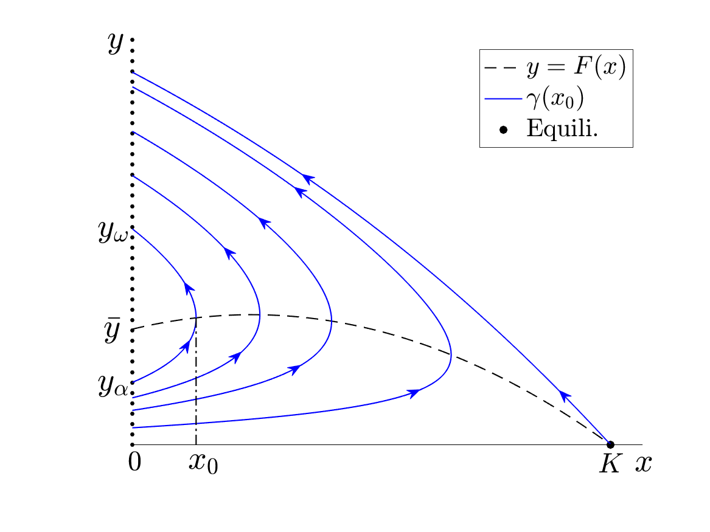
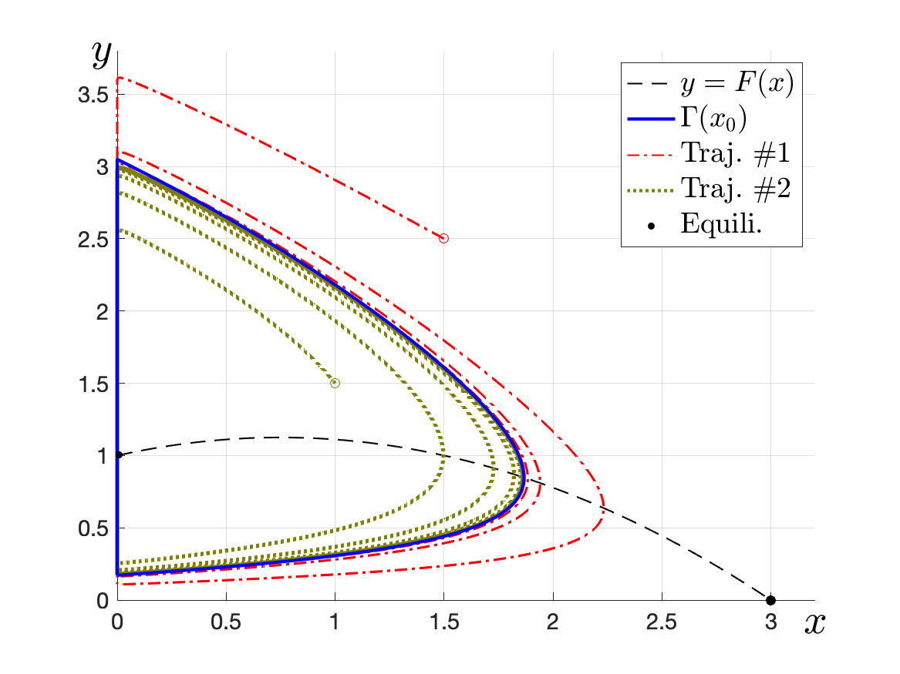

# Predator-Prey Model

## Journal Link

**Ting-Hao Hsu**, Number and stability of relaxation oscillations for predator-prey systems with small death rates, SIAM J. Appl. Dyn. Syst., 18 (2019), pp. 33-67.
[[doi:10.1137/18M1166705](https://doi.org/10.1137/18M1166705)]
[[arXiv.1801.02590](https://arxiv.org/abs/1801.02590)]

## Graphing

- Holling Type-II functional response: (Source code to be added)\
\

- Holling Type-IV functional response: (Source code to be added)\
\
\

