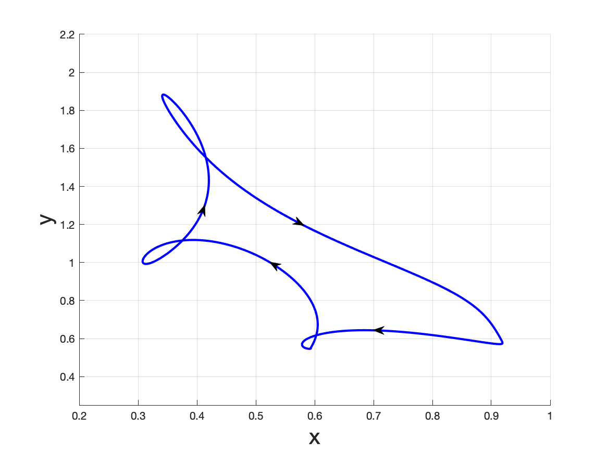

**Ting-Hao Hsu** and Shigui Ruan, *Relaxation oscillations and the entry-exit function in multi-dimensional slow-fast systems*, SIAM J. Math. Anal., 53 (2021), pp. 3717-3758.
[[doi:10.1137/19M1295507](https://doi.org/10.1137/19M1295507)]
[[arXiv.1910.06318](https://arxiv.org/abs/1910.06318)]

## Rapid-Evolution Models

- (Source code to be added.) Trade-off in predator-prey systems:

- (Source code to be added.) Prey-switching:

- (Source code to be added.) Co-Evolution:

