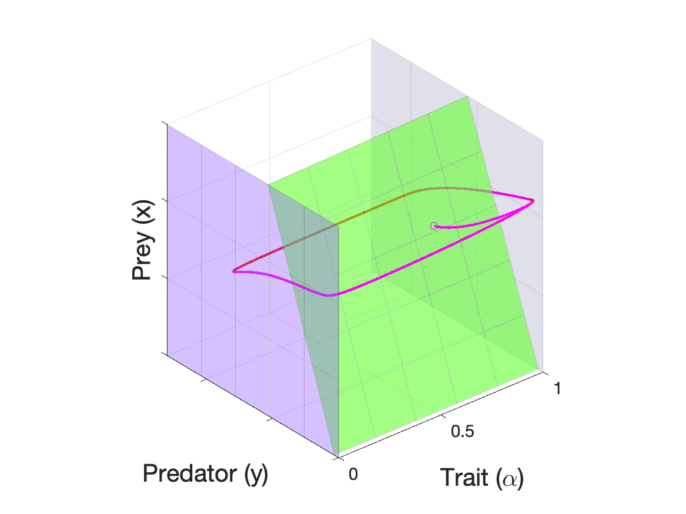
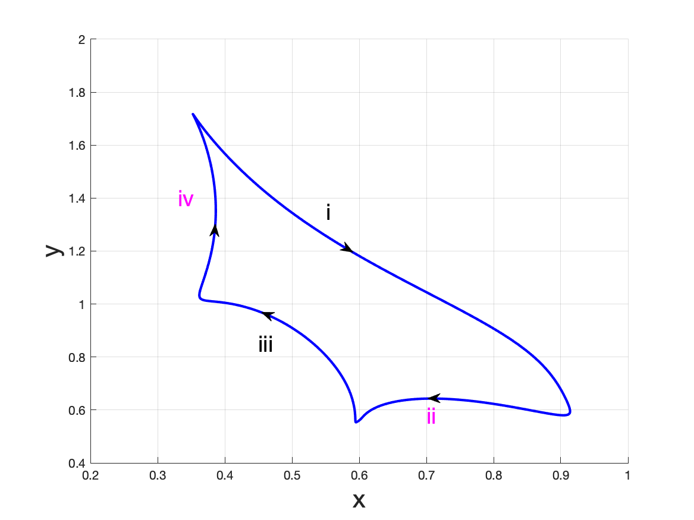

# Rapid-Evolution Models

## Journal Link

**Ting-Hao Hsu** and Shigui Ruan, *Relaxation oscillations and the entry-exit function in multi-dimensional slow-fast systems*, SIAM J. Math. Anal., 53 (2021), pp. 3717-3758.
[[doi:10.1137/19M1295507](https://doi.org/10.1137/19M1295507)]
[[arXiv.1910.06318](https://arxiv.org/abs/1910.06318)]

## Graphing

### Trade-Off in Predator-Prey Systems

Run the following MATLAB scripts in the given order.

1. [TradeOff_singular.m](TradeOff/TradeOff_singular.m), which
    - Finds the singular trajectory based on Newton's method.
    - Computes the eigenvalues of the singular transition function.\

2. [TradeOff_plot.m](TradeOff/TradeOff_plot.m), which plots the singular and the periodic orbits.\
\

### Prey-Switching

(Source code to be added)

### Co-Evolution

(Source code to be added)

